# Exploración agronómica y caracterización por parcela

El análisis comienza con la **caracterización individual de las parcelas de Bosque y Piña**: distribución de los valores, variación entre repeticiones y composición textural. Después presenta las comparaciones entre parcelas y usos del suelo dentro de finca. **Se asume la coherencia metodológica del muestreo**, según la indicación del responsable del estudio. R1, R2, etc. identifican submuestras de una misma parcela.

[Leer la interpretación agronómica de los resultados](interpretacion_agronomica.md).

## Cómo leer los resultados

- **Entre lotes:** cada parcela conserva su identidad; no se promedian todas las fincas por zona.
- **Entre tratamientos/usos:** se comparan las medias de Piña y Bosque dentro de la finca que corresponde en la ficha de campo.
- **Entre repeticiones:** los puntos y los mapas de valores muestran las submuestras R de cada parcela.
- **Dispersión:** las barras son media ± desviación estándar (DE) de submuestras, no intervalos de confianza ni error experimental entre parcelas. `n` cuenta submuestras con dato.
- **Diferencia:** Δ = media de Piña − media de Bosque; para variables en %, Δ se expresa en puntos porcentuales. El cambio relativo (%) es 100 × Δ / media de Bosque.

## Caracterización por parcela

Cada caja corresponde a una parcela y cada punto a una de sus submuestras R. La caja abarca Q1–Q3, la línea interior es la mediana y el rombo negro es la media. Los bigotes llegan a las observaciones dentro de 1,5 veces el rango intercuartil desde la caja. Se dibujan **todos los puntos**, incluidos los que quedan más allá de los bigotes. Con tres submuestras, los puntos permiten leer los valores que forman los cuartiles.

Las repeticiones mantienen su color y etiqueta dentro de cada figura. La escala vertical se ajusta a cada indicador y uso del suelo para mostrar su variación interna.

Consulta también las [fichas individuales de las 12 parcelas](caracterizacion_parcelas.md), con media, DE, mediana, cuartiles, rango, CV y valores de cada repetición.

### Bosque: distribución por parcela y repetición

**Densidad y porosidad**

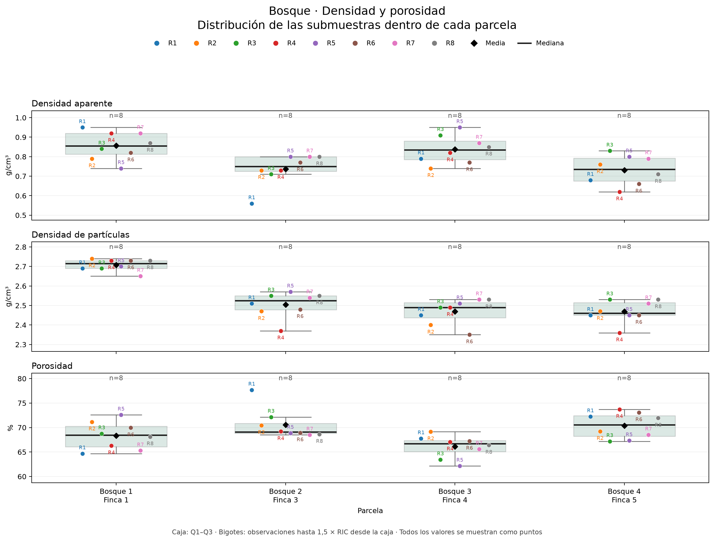

**Retención de humedad**

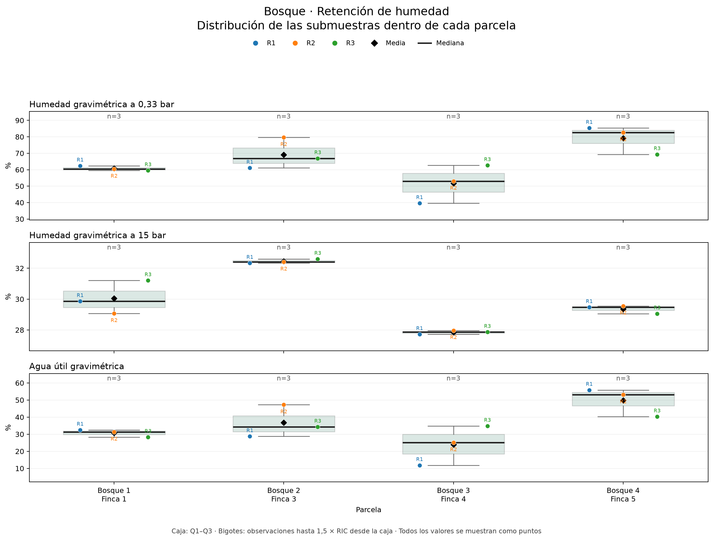

**Textura y estabilidad de agregados**

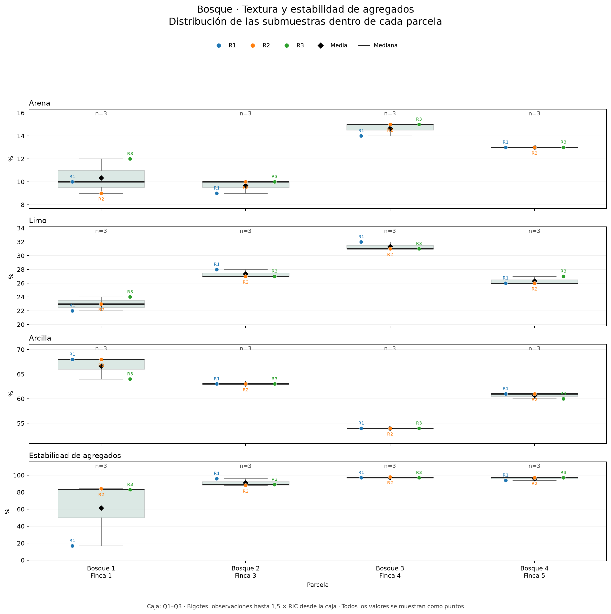

### Piña: distribución por parcela y repetición

**Densidad y porosidad**

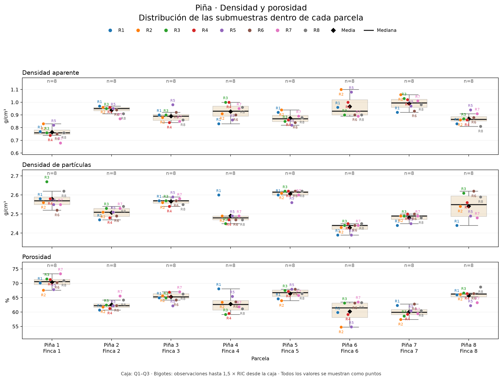

**Retención de humedad**

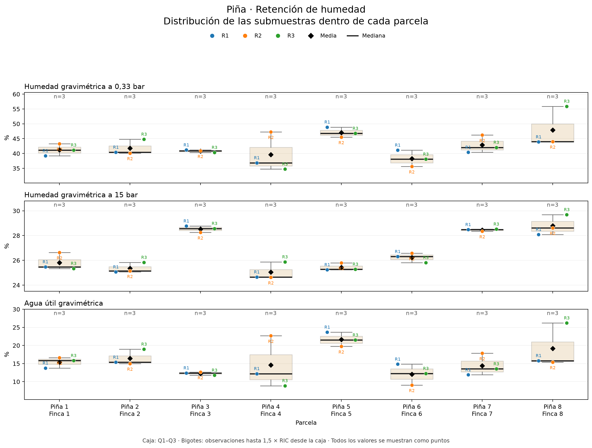

**Textura y estabilidad de agregados**

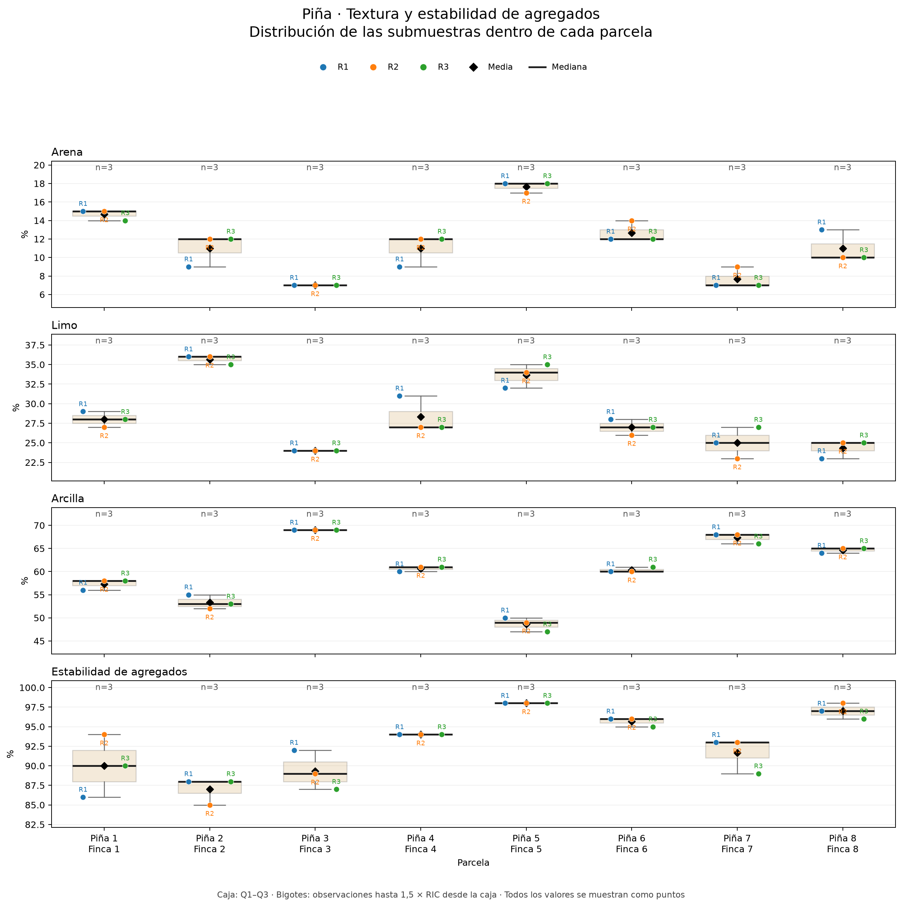

### Variabilidad interna de las parcelas

El coeficiente de variación (CV) expresa la DE como porcentaje de la media de cada parcela. Permite localizar qué parcelas presentan mayor dispersión relativa **para cada indicador**. Un CV alto no clasifica por sí solo la calidad del suelo. Un guion significa que el CV no es estimable.

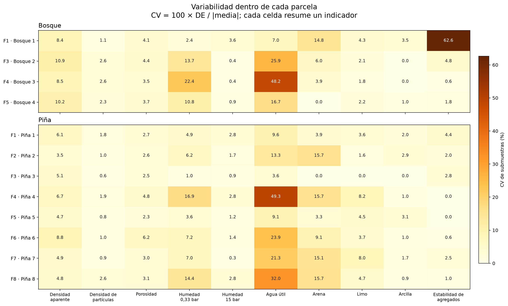

### Composición textural de cada parcela

Cada barra contiene los porcentajes medios de arena, limo y arcilla de una parcela. Se utilizan submuestras con las tres fracciones disponibles; `n` indica cuántas contribuyen a la barra. La dispersión de cada fracción se observa en los boxplots anteriores.

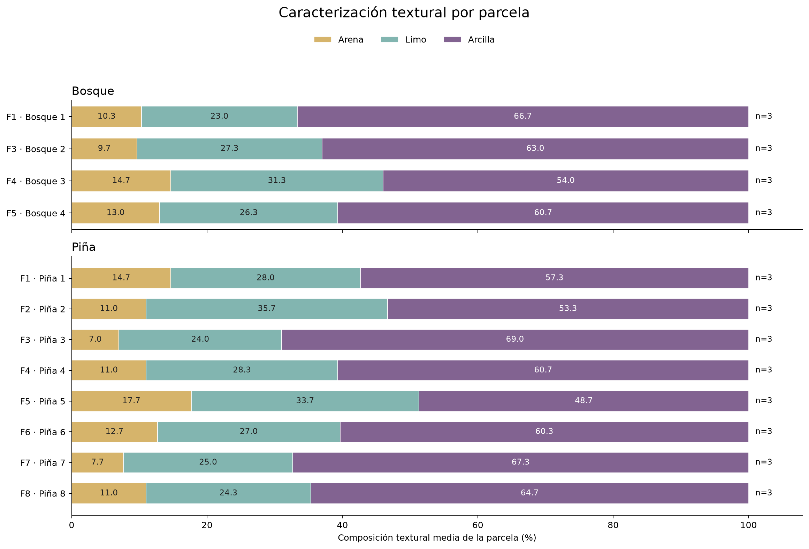

## Diseño de muestreo recuperado

La correspondencia procede de [PIÑA FINCAS PRODUCTORAS .xlsx](../raw/pina/PIÑA%20FINCAS%20PRODUCTORAS%20.xlsx). Los números de Bosque y Piña pertenecen a series distintas. Por ejemplo, **Bosque 2 corresponde a la finca 3, con Piña 3**, y no a Piña 2. `lote` conserva el número original; `finca_id` identifica la correspondencia de campo; `parcela` combina uso y lote.

| Finca | Piña | Bosque | Productor (ficha) |
| --- | --- | --- | --- |
| 1 | Piña 1 | Bosque 1 | Victor Trejos Sanchez |
| 2 | Piña 2 | Sin parcela | Alonso Chacon ultima fica |
| 3 | Piña 3 | Bosque 2 | Misael Rojas Solis |
| 4 | Piña 4 | Bosque 3 | Sergio Rojas Murillo |
| 5 | Piña 5 | Bosque 4 | Sergio Rojas Murillo |
| 6 | Piña 6 | Sin parcela | Marvin Zamora |
| 7 | Piña 7 | Sin parcela | Adrian Rodriguez Varela |
| 8 | Piña 8 | Sin parcela | Senen Murillo chavez |

Hay **8 parcelas de Piña y 4 de Bosque**, distribuidas en 8 códigos de finca. Solo las fincas **1, 3, 4 y 5** tienen ambos usos. Las fincas **4 y 5 pertenecen al mismo productor (Sergio Rojas)**: las cuatro comparaciones corresponden a tres productores. Las fincas 2, 6, 7 y 8 se describen sin asignarles un bosque de otra finca.

La base contiene 8 submuestras por parcela para densidad/porosidad y 3 para textura/estabilidad y retención de humedad. Las relaciones entre mediciones individuales se establecen por ID LAB, no solo por el número R. Textura y retención comparten 30 ID LAB. Las comparaciones Piña–Bosque utilizan las medias de las parcelas correspondientes.

## Auditoría de preparación

| Tabla | Filas de origen | Muestras únicas | Copias consolidadas | IDs con formato lote-submuestra |
| --- | --- | --- | --- | --- |
| densidad_porosidad | 96 | 96 | 0 | 16 |
| textural | 39 | 36 | 3 | 6 |
| retencion_humedad | 39 | 36 | 3 | 0 |

Se recuperó el número de submuestra en los identificadores `Piña 1-1` y `Bosque 1-1` (y sus secuencias), antes guardado como productor. Las copias de Piña 8 en textura y retención tenían el mismo ID LAB y los mismos resultados: se cuenta una sola muestra y se conservan ambas procedencias. Resultados discordantes para un mismo ID LAB detienen la preparación. Los archivos de origen permanecen intactos.

Controles de faltantes, dominios físicos y consistencia de variables calculadas: **0 observaciones para revisar**. Estos controles no sustituyen la revisión de laboratorio ni eliminan valores extremos.

## Cobertura de submuestras por parcela

| finca_id | tratamiento | lote | parcela | densidad_porosidad | retencion_humedad | textural |
| --- | --- | --- | --- | --- | --- | --- |
| 1 | Bosque | 1 | Bosque_1 | 8 | 3 | 3 |
| 1 | Piña | 1 | Pina_1 | 8 | 3 | 3 |
| 2 | Piña | 2 | Pina_2 | 8 | 3 | 3 |
| 3 | Bosque | 2 | Bosque_2 | 8 | 3 | 3 |
| 3 | Piña | 3 | Pina_3 | 8 | 3 | 3 |
| 4 | Bosque | 3 | Bosque_3 | 8 | 3 | 3 |
| 4 | Piña | 4 | Pina_4 | 8 | 3 | 3 |
| 5 | Bosque | 4 | Bosque_4 | 8 | 3 | 3 |
| 5 | Piña | 5 | Pina_5 | 8 | 3 | 3 |
| 6 | Piña | 6 | Pina_6 | 8 | 3 | 3 |
| 7 | Piña | 7 | Pina_7 | 8 | 3 | 3 |
| 8 | Piña | 8 | Pina_8 | 8 | 3 | 3 |

## Comparaciones complementarias entre parcelas

- **Densidad aparente:** la media de Piña es mayor que la de Bosque en 3 y menor en 1 de las 4 fincas comparables; Δ varía de -0.09 a +0.15 g/cm³.
- **Porosidad:** la media de Piña es mayor que la de Bosque en 1 y menor en 3 de las 4 fincas comparables; Δ varía de -5.28 a +2.01 puntos porcentuales.
- **Agua útil gravimétrica:** la media de Piña es mayor que la de Bosque en 0 y menor en 4 de las 4 fincas comparables; Δ varía de -28.12 a -9.32 puntos porcentuales.
- **Variación entre submuestras:** Bosque 1 (F1) presenta el mayor CV de estabilidad de agregados (62.60 %): R1 = 17.00 %; R2 = 84.00 %; R3 = 83.00 %. El boxplot y la ficha individual permiten observar esta dispersión.
- Estos patrones describen las parcelas observadas; no constituyen pruebas de significancia ni de causalidad.

### Densidad y porosidad

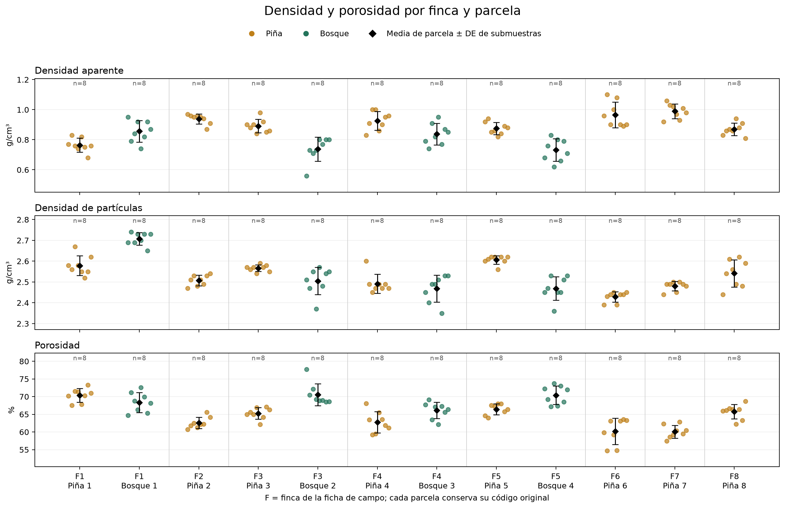

Diamantes negros: medias de parcela. Barras: ± DE entre submuestras. Puntos de color: observaciones individuales; su desplazamiento horizontal solo evita superposición.

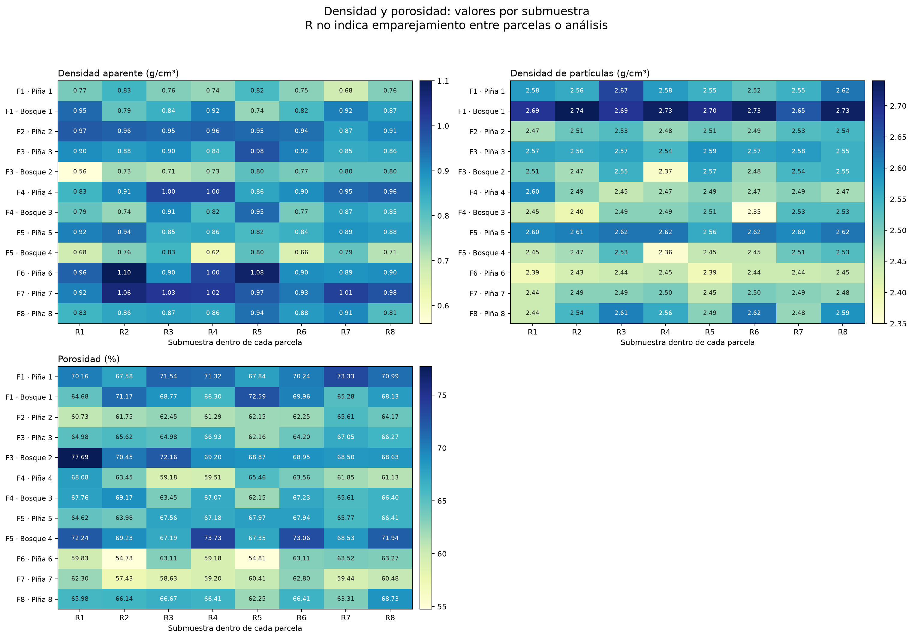

Cada fila es una parcela y cada columna una submuestra. La escala de color es propia de cada indicador. Un guion representa una combinación sin dato; no equivale a cero.

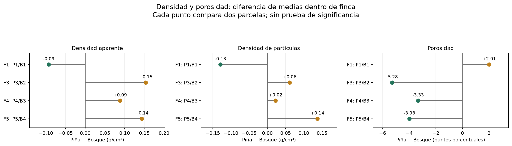

- **Densidad aparente:** las medias de parcela van de 0.73 g/cm³ (Bosque 4, F5) a 0.99 g/cm³ (Piña 7, F7).
- **Densidad de partículas:** las medias de parcela van de 2.43 g/cm³ (Piña 6, F6) a 2.71 g/cm³ (Bosque 1, F1).
- **Porosidad:** las medias de parcela van de 60.09 % (Piña 7, F7) a 70.56 % (Bosque 2, F3).

#### Medias y variación dentro de cada parcela

| Finca / parcela | Densidad aparente (g/cm³) | Densidad de partículas (g/cm³) | Porosidad (%) |
| --- | --- | --- | --- |
| F1 · Piña 1 | 0.76 ± 0.05 (n=8) | 2.58 ± 0.05 (n=8) | 70.37 ± 1.91 (n=8) |
| F1 · Bosque 1 | 0.86 ± 0.07 (n=8) | 2.71 ± 0.03 (n=8) | 68.36 ± 2.82 (n=8) |
| F2 · Piña 2 | 0.94 ± 0.03 (n=8) | 2.51 ± 0.03 (n=8) | 62.55 ± 1.60 (n=8) |
| F3 · Piña 3 | 0.89 ± 0.05 (n=8) | 2.57 ± 0.02 (n=8) | 65.28 ± 1.61 (n=8) |
| F3 · Bosque 2 | 0.74 ± 0.08 (n=8) | 2.50 ± 0.07 (n=8) | 70.56 ± 3.13 (n=8) |
| F4 · Piña 4 | 0.93 ± 0.06 (n=8) | 2.49 ± 0.05 (n=8) | 62.78 ± 3.01 (n=8) |
| F4 · Bosque 3 | 0.84 ± 0.07 (n=8) | 2.47 ± 0.06 (n=8) | 66.11 ± 2.31 (n=8) |
| F5 · Piña 5 | 0.88 ± 0.04 (n=8) | 2.61 ± 0.02 (n=8) | 66.43 ± 1.52 (n=8) |
| F5 · Bosque 4 | 0.73 ± 0.07 (n=8) | 2.47 ± 0.06 (n=8) | 70.41 ± 2.63 (n=8) |
| F6 · Piña 6 | 0.97 ± 0.09 (n=8) | 2.43 ± 0.02 (n=8) | 60.20 ± 3.73 (n=8) |
| F7 · Piña 7 | 0.99 ± 0.05 (n=8) | 2.48 ± 0.02 (n=8) | 60.09 ± 1.81 (n=8) |
| F8 · Piña 8 | 0.87 ± 0.04 (n=8) | 2.54 ± 0.07 (n=8) | 65.74 ± 2.04 (n=8) |

#### Diferencias Piña − Bosque dentro de finca

| Finca | Indicador | Media Piña | Media Bosque | Δ Piña − Bosque | Unidad de Δ | Cambio relativo (%) |
| --- | --- | --- | --- | --- | --- | --- |
| 1 | Densidad aparente | 0.76 | 0.86 | -0.09 | g/cm³ | -10.80 |
| 1 | Densidad de partículas | 2.58 | 2.71 | -0.13 | g/cm³ | -4.76 |
| 1 | Porosidad | 70.37 | 68.36 | 2.01 | puntos porcentuales | 2.94 |
| 3 | Densidad aparente | 0.89 | 0.74 | 0.15 | g/cm³ | 20.85 |
| 3 | Densidad de partículas | 2.57 | 2.50 | 0.06 | g/cm³ | 2.45 |
| 3 | Porosidad | 65.28 | 70.56 | -5.28 | puntos porcentuales | -7.48 |
| 4 | Densidad aparente | 0.93 | 0.84 | 0.09 | g/cm³ | 10.60 |
| 4 | Densidad de partículas | 2.49 | 2.47 | 0.02 | g/cm³ | 0.91 |
| 4 | Porosidad | 62.78 | 66.11 | -3.33 | puntos porcentuales | -5.03 |
| 5 | Densidad aparente | 0.88 | 0.73 | 0.14 | g/cm³ | 19.66 |
| 5 | Densidad de partículas | 2.61 | 2.47 | 0.14 | g/cm³ | 5.57 |
| 5 | Porosidad | 66.43 | 70.41 | -3.98 | puntos porcentuales | -5.65 |

### Retención de humedad

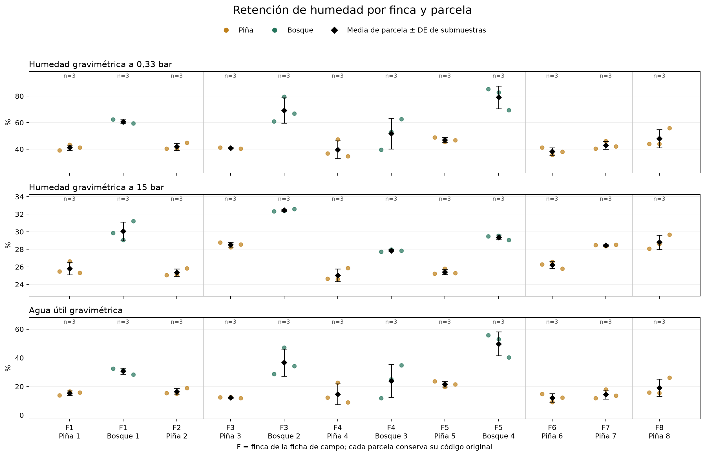

Diamantes negros: medias de parcela. Barras: ± DE entre submuestras. Puntos de color: observaciones individuales; su desplazamiento horizontal solo evita superposición.

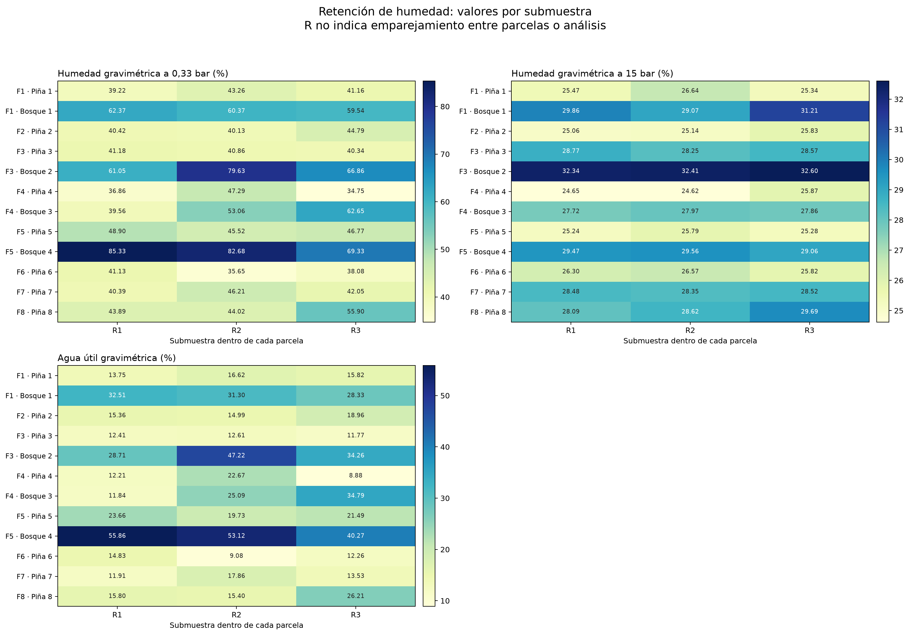

Cada fila es una parcela y cada columna una submuestra. La escala de color es propia de cada indicador. Un guion representa una combinación sin dato; no equivale a cero.

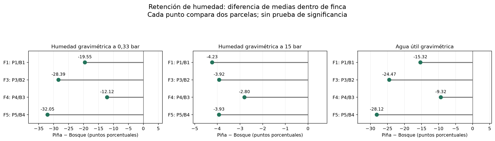

- **Humedad gravimétrica a 0,33 bar:** las medias de parcela van de 38.29 % (Piña 6, F6) a 79.11 % (Bosque 4, F5).
- **Humedad gravimétrica a 15 bar:** las medias de parcela van de 25.05 % (Piña 4, F4) a 32.45 % (Bosque 2, F3).
- **Agua útil gravimétrica:** las medias de parcela van de 12.06 % (Piña 6, F6) a 49.75 % (Bosque 4, F5).

#### Medias y variación dentro de cada parcela

| Finca / parcela | Humedad gravimétrica a 0,33 bar (%) | Humedad gravimétrica a 15 bar (%) | Agua útil gravimétrica (%) |
| --- | --- | --- | --- |
| F1 · Piña 1 | 41.21 ± 2.02 (n=3) | 25.82 ± 0.72 (n=3) | 15.40 ± 1.48 (n=3) |
| F1 · Bosque 1 | 60.76 ± 1.45 (n=3) | 30.05 ± 1.08 (n=3) | 30.71 ± 2.15 (n=3) |
| F2 · Piña 2 | 41.78 ± 2.61 (n=3) | 25.34 ± 0.42 (n=3) | 16.44 ± 2.19 (n=3) |
| F3 · Piña 3 | 40.79 ± 0.42 (n=3) | 28.53 ± 0.26 (n=3) | 12.26 ± 0.44 (n=3) |
| F3 · Bosque 2 | 69.18 ± 9.50 (n=3) | 32.45 ± 0.13 (n=3) | 36.73 ± 9.50 (n=3) |
| F4 · Piña 4 | 39.63 ± 6.71 (n=3) | 25.05 ± 0.71 (n=3) | 14.59 ± 7.20 (n=3) |
| F4 · Bosque 3 | 51.76 ± 11.60 (n=3) | 27.85 ± 0.13 (n=3) | 23.91 ± 11.52 (n=3) |
| F5 · Piña 5 | 47.06 ± 1.71 (n=3) | 25.44 ± 0.31 (n=3) | 21.63 ± 1.97 (n=3) |
| F5 · Bosque 4 | 79.11 ± 8.58 (n=3) | 29.36 ± 0.27 (n=3) | 49.75 ± 8.32 (n=3) |
| F6 · Piña 6 | 38.29 ± 2.75 (n=3) | 26.23 ± 0.38 (n=3) | 12.06 ± 2.88 (n=3) |
| F7 · Piña 7 | 42.88 ± 3.00 (n=3) | 28.45 ± 0.09 (n=3) | 14.43 ± 3.08 (n=3) |
| F8 · Piña 8 | 47.94 ± 6.90 (n=3) | 28.80 ± 0.82 (n=3) | 19.14 ± 6.13 (n=3) |

#### Diferencias Piña − Bosque dentro de finca

| Finca | Indicador | Media Piña | Media Bosque | Δ Piña − Bosque | Unidad de Δ | Cambio relativo (%) |
| --- | --- | --- | --- | --- | --- | --- |
| 1 | Humedad gravimétrica a 0,33 bar | 41.21 | 60.76 | -19.55 | puntos porcentuales | -32.17 |
| 1 | Humedad gravimétrica a 15 bar | 25.82 | 30.05 | -4.23 | puntos porcentuales | -14.08 |
| 1 | Agua útil gravimétrica | 15.40 | 30.71 | -15.32 | puntos porcentuales | -49.87 |
| 3 | Humedad gravimétrica a 0,33 bar | 40.79 | 69.18 | -28.39 | puntos porcentuales | -41.03 |
| 3 | Humedad gravimétrica a 15 bar | 28.53 | 32.45 | -3.92 | puntos porcentuales | -12.08 |
| 3 | Agua útil gravimétrica | 12.26 | 36.73 | -24.47 | puntos porcentuales | -66.61 |
| 4 | Humedad gravimétrica a 0,33 bar | 39.63 | 51.76 | -12.12 | puntos porcentuales | -23.42 |
| 4 | Humedad gravimétrica a 15 bar | 25.05 | 27.85 | -2.80 | puntos porcentuales | -10.07 |
| 4 | Agua útil gravimétrica | 14.59 | 23.91 | -9.32 | puntos porcentuales | -38.98 |
| 5 | Humedad gravimétrica a 0,33 bar | 47.06 | 79.11 | -32.05 | puntos porcentuales | -40.51 |
| 5 | Humedad gravimétrica a 15 bar | 25.44 | 29.36 | -3.93 | puntos porcentuales | -13.37 |
| 5 | Agua útil gravimétrica | 21.63 | 49.75 | -28.12 | puntos porcentuales | -56.53 |

### Textura y estabilidad de agregados

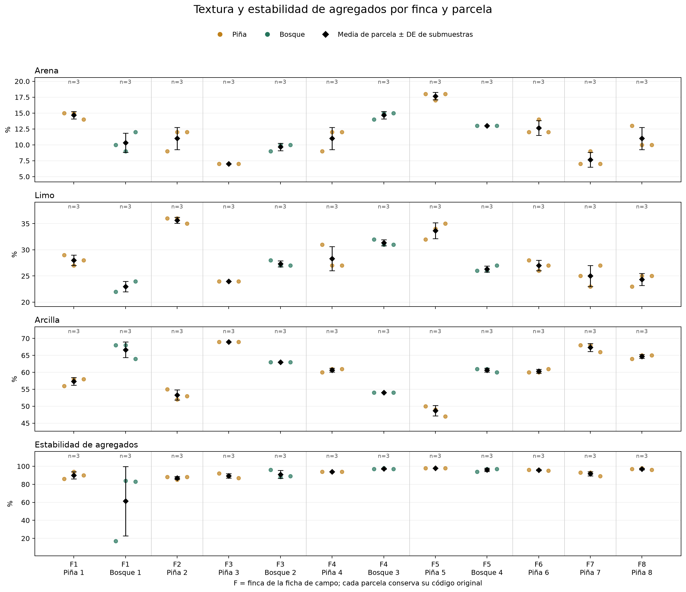

Diamantes negros: medias de parcela. Barras: ± DE entre submuestras. Puntos de color: observaciones individuales; su desplazamiento horizontal solo evita superposición.

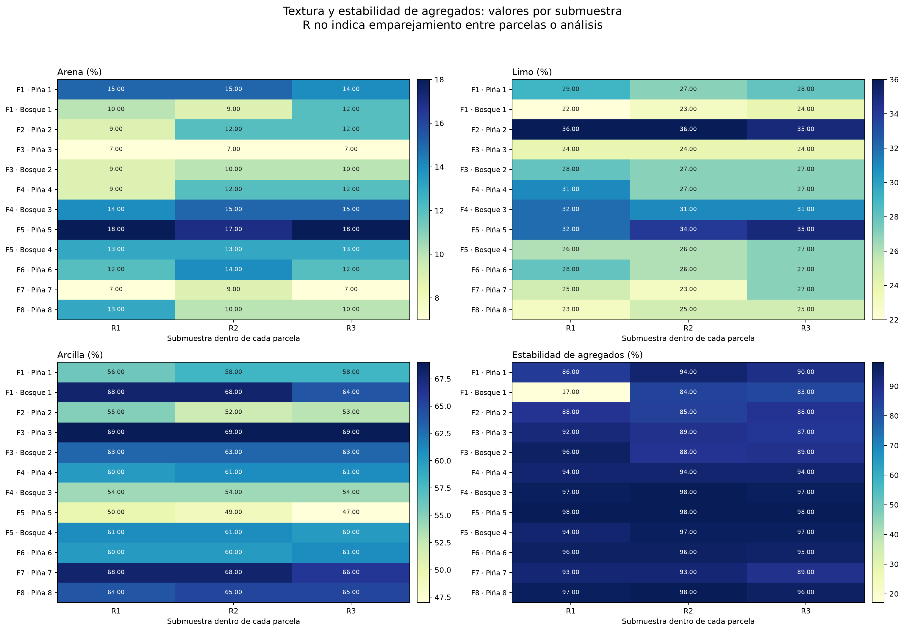

Cada fila es una parcela y cada columna una submuestra. La escala de color es propia de cada indicador. Un guion representa una combinación sin dato; no equivale a cero.

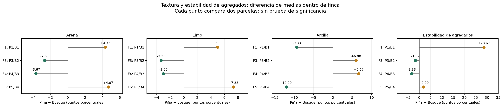

- **Arena:** las medias de parcela van de 7.00 % (Piña 3, F3) a 17.67 % (Piña 5, F5).
- **Limo:** las medias de parcela van de 23.00 % (Bosque 1, F1) a 35.67 % (Piña 2, F2).
- **Arcilla:** las medias de parcela van de 48.67 % (Piña 5, F5) a 69.00 % (Piña 3, F3).
- **Estabilidad de agregados:** las medias de parcela van de 61.33 % (Bosque 1, F1) a 98.00 % (Piña 5, F5).

#### Medias y variación dentro de cada parcela

| Finca / parcela | Arena (%) | Limo (%) | Arcilla (%) | Estabilidad de agregados (%) |
| --- | --- | --- | --- | --- |
| F1 · Piña 1 | 14.67 ± 0.58 (n=3) | 28.00 ± 1.00 (n=3) | 57.33 ± 1.15 (n=3) | 90.00 ± 4.00 (n=3) |
| F1 · Bosque 1 | 10.33 ± 1.53 (n=3) | 23.00 ± 1.00 (n=3) | 66.67 ± 2.31 (n=3) | 61.33 ± 38.40 (n=3) |
| F2 · Piña 2 | 11.00 ± 1.73 (n=3) | 35.67 ± 0.58 (n=3) | 53.33 ± 1.53 (n=3) | 87.00 ± 1.73 (n=3) |
| F3 · Piña 3 | 7.00 ± 0.00 (n=3) | 24.00 ± 0.00 (n=3) | 69.00 ± 0.00 (n=3) | 89.33 ± 2.52 (n=3) |
| F3 · Bosque 2 | 9.67 ± 0.58 (n=3) | 27.33 ± 0.58 (n=3) | 63.00 ± 0.00 (n=3) | 91.00 ± 4.36 (n=3) |
| F4 · Piña 4 | 11.00 ± 1.73 (n=3) | 28.33 ± 2.31 (n=3) | 60.67 ± 0.58 (n=3) | 94.00 ± 0.00 (n=3) |
| F4 · Bosque 3 | 14.67 ± 0.58 (n=3) | 31.33 ± 0.58 (n=3) | 54.00 ± 0.00 (n=3) | 97.33 ± 0.58 (n=3) |
| F5 · Piña 5 | 17.67 ± 0.58 (n=3) | 33.67 ± 1.53 (n=3) | 48.67 ± 1.53 (n=3) | 98.00 ± 0.00 (n=3) |
| F5 · Bosque 4 | 13.00 ± 0.00 (n=3) | 26.33 ± 0.58 (n=3) | 60.67 ± 0.58 (n=3) | 96.00 ± 1.73 (n=3) |
| F6 · Piña 6 | 12.67 ± 1.15 (n=3) | 27.00 ± 1.00 (n=3) | 60.33 ± 0.58 (n=3) | 95.67 ± 0.58 (n=3) |
| F7 · Piña 7 | 7.67 ± 1.15 (n=3) | 25.00 ± 2.00 (n=3) | 67.33 ± 1.15 (n=3) | 91.67 ± 2.31 (n=3) |
| F8 · Piña 8 | 11.00 ± 1.73 (n=3) | 24.33 ± 1.15 (n=3) | 64.67 ± 0.58 (n=3) | 97.00 ± 1.00 (n=3) |

#### Diferencias Piña − Bosque dentro de finca

| Finca | Indicador | Media Piña | Media Bosque | Δ Piña − Bosque | Unidad de Δ | Cambio relativo (%) |
| --- | --- | --- | --- | --- | --- | --- |
| 1 | Arena | 14.67 | 10.33 | 4.33 | puntos porcentuales | 41.94 |
| 1 | Limo | 28.00 | 23.00 | 5.00 | puntos porcentuales | 21.74 |
| 1 | Arcilla | 57.33 | 66.67 | -9.33 | puntos porcentuales | -14.00 |
| 1 | Estabilidad de agregados | 90.00 | 61.33 | 28.67 | puntos porcentuales | 46.74 |
| 3 | Arena | 7.00 | 9.67 | -2.67 | puntos porcentuales | -27.59 |
| 3 | Limo | 24.00 | 27.33 | -3.33 | puntos porcentuales | -12.20 |
| 3 | Arcilla | 69.00 | 63.00 | 6.00 | puntos porcentuales | 9.52 |
| 3 | Estabilidad de agregados | 89.33 | 91.00 | -1.67 | puntos porcentuales | -1.83 |
| 4 | Arena | 11.00 | 14.67 | -3.67 | puntos porcentuales | -25.00 |
| 4 | Limo | 28.33 | 31.33 | -3.00 | puntos porcentuales | -9.57 |
| 4 | Arcilla | 60.67 | 54.00 | 6.67 | puntos porcentuales | 12.35 |
| 4 | Estabilidad de agregados | 94.00 | 97.33 | -3.33 | puntos porcentuales | -3.42 |
| 5 | Arena | 17.67 | 13.00 | 4.67 | puntos porcentuales | 35.90 |
| 5 | Limo | 33.67 | 26.33 | 7.33 | puntos porcentuales | 27.85 |
| 5 | Arcilla | 48.67 | 60.67 | -12.00 | puntos porcentuales | -19.78 |
| 5 | Estabilidad de agregados | 98.00 | 96.00 | 2.00 | puntos porcentuales | 2.08 |

## Lectura agronómica y alcance

La exploración permite localizar parcelas con valores distintos y verificar si la dirección de la diferencia Piña–Bosque se repite entre fincas. La textura describe el contexto de cada parcela; no se interpreta toda diferencia como un efecto del manejo. La porosidad se calcula a partir de las densidades y el agua útil como diferencia de las dos humedades: no son mediciones independientes de sus componentes.

La humedad y el agua útil permanecen en base **gravimétrica**. La conversión a humedad volumétrica requiere una densidad aparente compatible con el muestreo; para expresar una lámina de agua se necesita además la profundidad de suelo representada.

Esta etapa es **descriptiva**: caracteriza las parcelas y sus submuestras. La media y la mediana describen el nivel de cada indicador; la DE, los cuartiles, el rango y el CV describen su dispersión dentro de parcela. Las comparaciones entre usos complementan esta caracterización. La inferencia estadística corresponde a una etapa posterior que represente la estructura de fincas, parcelas y submuestras.

## Archivos y reproducción

- [Diseño de muestreo](../processed/diseno_muestreo.csv).
- [Resumen por parcela e indicador](tablas/resumen_por_parcela.csv): n válido, faltantes, media, DE, mediana, Q1, Q3, rango intercuartil, mínimo, máximo, amplitud y CV de submuestras; el CV no es el CV residual de un ANOVA.
- [Fichas individuales por parcela](caracterizacion_parcelas.md), con resúmenes y repeticiones.
- [Composición textural por parcela](tablas/composicion_textural_por_parcela.csv).
- [Comparaciones dentro de finca](tablas/comparaciones_pina_bosque.csv).
- [Valores individuales](tablas/valores_por_submuestra.csv), con ID LAB y procedencia.
- [Clases texturales por parcela](tablas/clases_texturales.csv).
- [Controles de calidad](tablas/controles_calidad.csv).
- [Auditoría de preparación](../processed/auditoria_preparacion.csv) y [registros de duplicados](../processed/duplicados_consolidados.csv).
- Figuras en `docs/figuras/agronomico/`, en PNG y SVG para exportación. Las figuras antiguas `*_por_zona.png` no forman parte de este informe.

Desde la raíz del proyecto, usando el entorno existente:

```powershell
.\.venv\Scripts\python.exe src/01_soil_data_pipeline.py
.\.venv\Scripts\python.exe src/03_exploratory_analysis.py
```
